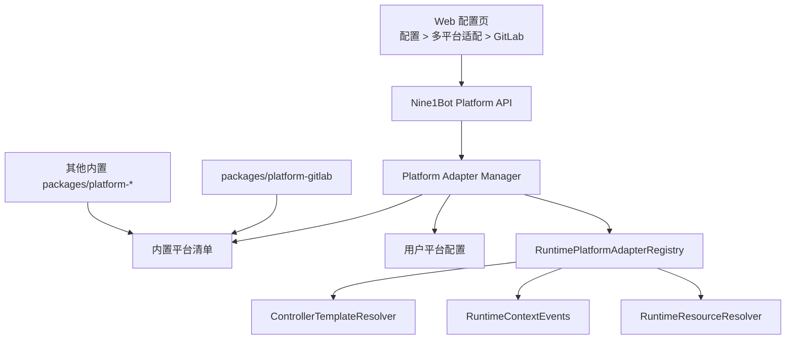

# Platform Adapter Manager 与可插拔平台适配

这份文档定义 Nine1Bot 多平台深度适配的产品级管理方式。`packages/platform-*` 已经解决了“平台代码不要写进 runtime core”的边界问题，但还需要一层可发现、可配置、可展示、可审计的 Platform Adapter Manager，避免 GitLab、GitHub、Jira、飞书文档等适配能力继续通过硬编码注册和启用。

当前阶段只考虑内置平台的插件式管理：平台包仍随 Nine1Bot workspace 一起发布，Platform Manager 负责统一启用、禁用、展示和注册。外部平台包安装、平台市场、本地路径加载等动态扩展能力只保留协议余量，暂不纳入实现范围。

## 目标

- 平台深度适配具备插件式生命周期，可以启用、禁用和查看状态。
- 新平台接入不需要修改 runtime core。
- Web 配置页能展示所有平台适配，并允许进入每个平台自己的配置/状态页面。
- 每个平台可以声明自己的配置字段、状态区块和操作按钮，Platform Manager 负责用统一协议承载这些差异。
- Controller、Context Pipeline、Resource Resolver 只消费当前启用的平台适配贡献。
- profileSnapshot 仍然记录会话创建时的平台模板和资源声明，当前平台配置作为 live gate 控制后续实际可用性。

## 分层



### RuntimePlatformAdapterRegistry

Runtime registry 继续保持轻量，只提供通用调用协议：

- `matchPage`
- `normalizePage`
- `blocksFromPage`
- `inferTemplateIds`
- `templateContextBlocks`
- `resourceContributions`
- `recommendedAgent`

它不负责用户配置、安装状态、授权状态和 Web 展示。

### Platform Package

每个平台独立放在 `packages/platform-*`，例如：

- `packages/platform-gitlab`
- `packages/platform-github`
- `packages/platform-jira`
- `packages/platform-feishu-docs`

平台包只提供平台语义、adapter factory、配置描述、状态描述和操作处理，不直接修改 runtime registry。

### Platform Adapter Manager

Platform Adapter Manager 位于 Nine1Bot 产品层，负责平台适配的生命周期：

- 发现内置平台 adapter contribution。
- 读取 `nine1bot.config` 中的平台开关和平台设置。
- 判断平台状态：`available`、`enabled`、`disabled`、`missing`、`auth-required`、`degraded`。
- 将启用且可用的平台 adapter 注册进 `RuntimePlatformAdapterRegistry`。
- 向 Web 配置页和 debug API 暴露平台列表、能力、状态、错误、健康检查结果和平台自定义详情页描述。
- 接收 Web 详情页触发的平台操作，并转发给对应平台 adapter 的 action handler。

### 状态生命周期

Platform Manager 内部应维护比 Web 展示更细的状态机：

```text
discovered -> configured -> enabled -> registered -> healthy
                                      -> degraded
                                      -> error
```

这些状态含义如下：

- `discovered`：内置平台 contribution 已被发现。
- `configured`：已合并默认配置和用户配置。
- `enabled`：用户配置允许启用该平台。
- `registered`：平台 runtime adapter 已注册进 `RuntimePlatformAdapterRegistry`。
- `healthy`：平台当前可正常参与模板、上下文或资源贡献。
- `degraded`：平台部分能力不可用，例如 API enrichment 失败，但基础 page context 仍可用。
- `error`：平台配置错误、依赖缺失或初始化失败，不能参与 runtime。

Web 可以展示合并后的 `available`、`disabled`、`auth-required`、`degraded`、`error`，但 debug/audit 应保留内部状态，方便判断问题发生在发现、配置、启用、注册还是健康检查阶段。

## Platform Descriptor 与 Contribution

平台协议类型统一由 `@nine1bot/platform-protocol` 提供。每个平台包应导出一个稳定的 descriptor 和一个服务端 contribution。descriptor 是可序列化的能力描述，可以返回给 Web；contribution 是服务端运行时对象，包含创建 adapter、读取状态、校验配置、执行 action 等函数。

这两者必须分开：Web 配置页只消费 descriptor / status / settings / actions，不能感知服务端 handler；Platform Manager 在服务端持有 contribution，用它完成注册和操作转发。

```ts
export type PlatformDescriptor = {
  id: string
  name: string
  packageName: string
  version: string
  description?: string
  defaultEnabled?: boolean
  capabilities: {
    pageContext?: boolean
    templates?: string[]
    resources?: boolean
    browserExtension?: boolean
    auth?: 'none' | 'token' | 'oauth' | 'external'
    settingsPage?: boolean
    statusPage?: boolean
  }
  config?: PlatformConfigDescriptor
  detailPage?: PlatformDetailPageDescriptor
  actions?: PlatformActionDescriptor[]
  browser?: {
    safeExports?: string[]
  }
  web?: {
    componentKeys?: string[]
  }
}

export type PlatformAdapterContribution = {
  descriptor: PlatformDescriptor
  runtime?: {
    createAdapter: (ctx: PlatformAdapterContext) => PlatformAdapter
  }
  getStatus?: (ctx: PlatformAdapterContext) => Promise<PlatformRuntimeStatus>
  validateConfig?: (settings: unknown, ctx: PlatformAdapterContext) => Promise<PlatformValidationResult>
  handleAction?: (
    actionId: string,
    input: unknown,
    ctx: PlatformAdapterContext,
  ) => Promise<PlatformActionResult>
}
```

`descriptor.config`、`descriptor.detailPage` 和 `descriptor.actions` 是 Platform Manager 与平台适配层之间的展示/操作协议：

- `config` 描述平台配置字段和校验规则。
- `detailPage` 描述平台详情页应该展示哪些状态区块、配置表单、操作区和自定义组件入口。
- `actions` 描述平台支持的操作，例如测试连接、刷新状态、打开外部登录、导入 token、清除认证、重新扫描仓库等。

认证不应该被固定成统一的 `auth/start` / `auth/complete` 流程。不同平台可以用完全不同的 action 表达自己的认证方式：GitLab 可以提供 token 配置和连接测试，飞书可以提供外部 CLI 状态检查和打开官方登录指引，OAuth 平台可以提供打开授权链接和接收回调后的状态刷新。

GitLab 样板可以提供：

```ts
export const gitlabPlatformContribution = {
  descriptor: {
    id: 'gitlab',
    name: 'GitLab',
    packageName: '@nine1bot/platform-gitlab',
    version: '0.1.0',
    defaultEnabled: true,
    capabilities: {
      pageContext: true,
      templates: ['browser-gitlab', 'gitlab-repo', 'gitlab-file', 'gitlab-mr', 'gitlab-issue'],
      resources: true,
      browserExtension: true,
      auth: 'token',
      settingsPage: true,
      statusPage: true,
    },
    config: {
      sections: [
        {
          id: 'hosts',
          title: '访问范围',
          fields: [
            {
              key: 'allowedHosts',
              type: 'string-list',
              label: '允许的 GitLab Host',
            },
            {
              key: 'apiEnrichment',
              type: 'select',
              label: 'API 信息补全',
              options: ['auto', 'disabled'],
            },
          ],
        },
      ],
    },
    detailPage: {
      sections: [
        { id: 'status', type: 'status-cards', title: '状态' },
        { id: 'settings', type: 'settings-form', title: '配置' },
        { id: 'actions', type: 'action-list', title: '操作' },
        { id: 'recent-events', type: 'event-list', title: '最近事件' },
      ],
    },
    actions: [
      {
        id: 'connection.test',
        label: '测试连接',
        kind: 'button',
      },
    ],
  },
  runtime: {
    createAdapter: createGitLabPlatformAdapter,
  },
  getStatus: getGitLabPlatformStatus,
  validateConfig: validateGitLabPlatformConfig,
  handleAction: handleGitLabPlatformAction,
}
```

### 配置/状态/操作协议

Platform Manager 与平台适配层之间应使用结构化协议传递配置、状态和操作，而不是为每个平台新增后端 route 或前端硬编码逻辑。

```ts
export type PlatformConfigDescriptor = {
  sections: Array<{
    id: string
    title: string
    description?: string
    fields: PlatformConfigField[]
  }>
}

export type PlatformConfigField = {
  key: string
  label: string
  type: 'string' | 'password' | 'boolean' | 'number' | 'select' | 'string-list' | 'json'
  description?: string
  required?: boolean
  options?: string[]
  secret?: boolean
}

export type PlatformDetailPageDescriptor = {
  sections: Array<{
    id: string
    title: string
    type: 'status-cards' | 'settings-form' | 'action-list' | 'event-list' | 'capability-list' | 'custom'
    componentKey?: string
  }>
}

export type PlatformActionDescriptor = {
  id: string
  label: string
  description?: string
  kind: 'button' | 'form' | 'link'
  inputSchema?: PlatformConfigDescriptor
  danger?: boolean
}

export type PlatformRuntimeStatus = {
  status: 'available' | 'disabled' | 'missing' | 'auth-required' | 'degraded' | 'error'
  message?: string
  cards?: Array<{
    id: string
    label: string
    value: string
    tone?: 'neutral' | 'success' | 'warning' | 'danger'
  }>
  recentEvents?: PlatformRecentEvent[]
}
```

Web 可以先用通用 renderer 展示 `status-cards`、`settings-form`、`action-list` 和 `event-list`。如果某个平台需要更强的交互，可以通过 `custom + componentKey` 接入一个内置平台详情组件，但数据保存、状态查询、操作执行仍然走 Platform Manager 的统一 API。

平台适配层通过 `PlatformAdapterContribution` 提供对应 handler。Platform Manager 负责把当前配置、环境信息、项目目录和安全存储访问能力放进 `PlatformAdapterContext`，平台适配层只处理自己的业务差异。

```ts
export type PlatformAdapterContext = {
  platformId: string
  projectId?: string
  projectDirectory?: string
  enabled: boolean
  settings: unknown
  features: Record<string, boolean>
  env: Record<string, string | undefined>
  secrets: PlatformSecretAccess
  audit: PlatformAuditWriter
}
```

这样认证、健康检查、状态刷新、外部工具调用都可以作为 action 实现，不需要提前假设所有平台都有相同认证流程。

## 用户配置

平台配置应该是 Nine1Bot 产品配置的一部分，而不是 runtime core 配置。

```jsonc
{
  "platforms": {
    "gitlab": {
      "enabled": true,
      "features": {
        "pageContext": true,
        "templates": true,
        "resources": true
      },
      "settings": {
        "allowedHosts": ["gitlab.com"],
        "apiEnrichment": "auto"
      }
    },
    "github": {
      "enabled": false
    }
  }
}
```

配置语义：

- `enabled: false` 是 hard gate，不注册该平台 adapter。
- `features` 允许平台内部按能力开关，例如只启用 page context，不启用资源贡献。
- `settings` 是平台自己的配置空间，由对应平台页面展示和保存。
- 未安装或未发现的平台配置保留在文件中，但状态显示为 `missing`。
- 平台配置变化后，新 session 立即按新配置创建 profile；旧 session 的后续 turn 按 live gate 判断是否还能使用平台能力。

## 密钥与敏感配置

平台适配可能需要 token、password、private key、OAuth refresh token、外部工具认证状态等敏感信息。这些值不应该写入 `nine1bot.config`、项目配置、profileSnapshot、turn snapshot、audit 或 debug event。

配置文件只保存普通 settings 和密钥引用：

```jsonc
{
  "platforms": {
    "gitlab": {
      "enabled": true,
      "settings": {
        "allowedHosts": ["gitlab.com"],
        "apiEnrichment": "auto",
        "tokenRef": {
          "provider": "nine1bot-local",
          "key": "platform:gitlab:default:token"
        }
      }
    }
  }
}
```

推荐第一阶段使用 Nine1Bot 本地 secret store：

```text
Windows: %LOCALAPPDATA%\nine1bot\platform-secrets.json
Unix:    ~/.local/share/nine1bot/platform-secrets.json
```

或在后续需要更细隔离时使用平台目录：

```text
%LOCALAPPDATA%\nine1bot\platforms\gitlab\secrets.json
~/.local/share/nine1bot/platforms/gitlab/secrets.json
```

密钥引用结构：

```ts
export type PlatformSecretRef = {
  provider: 'nine1bot-local' | 'env' | 'external'
  key: string
}

export type PlatformSecretAccess = {
  get(ref: PlatformSecretRef): Promise<string | undefined>
  set(ref: PlatformSecretRef, value: string): Promise<void>
  delete(ref: PlatformSecretRef): Promise<void>
  has(ref: PlatformSecretRef): Promise<boolean>
}
```

`provider` 语义：

- `nine1bot-local`：由 Nine1Bot 写入本地 data 目录的 secret store。
- `env`：真实值来自环境变量，配置中只保存环境变量名。
- `external`：真实认证由外部工具或平台适配层管理，例如官方 CLI、浏览器登录态或企业内部认证组件。

Web API 返回平台详情时必须脱敏：

```ts
type RedactedPlatformSecretField = {
  key: string
  hasValue: boolean
  redacted: true
  provider?: PlatformSecretRef['provider']
}
```

保存配置时：

1. Web 如果提交了 secret 字段，Platform Manager 将真实值写入 secret store。
2. Platform Manager 只把 `PlatformSecretRef` 写入平台 settings。
3. 后续 `GET /nine1bot/platforms/:id` 只返回 `hasValue` / `redacted`，不返回真实值。
4. 平台 contribution 的 `getStatus`、`validateConfig`、`handleAction` 只能通过 `ctx.secrets` 读取真实密钥。

安全约束：

- secret 字段不能进入 profileSnapshot、turn snapshot、runtime event、audit 和 debug payload。
- action input 中如果包含 secret，写 audit 时必须按字段级 redaction 处理。
- secret store 文件应创建在用户 data 目录，并尽量使用当前用户可读写的文件权限。
- OS Keychain 可以作为后续增强，但第一阶段不作为必需依赖，避免 Windows/macOS/Linux 打包、权限和失败路径过早复杂化。

## 注册生命周期

服务启动时：

1. Platform Manager 加载内置平台 contribution。
2. 读取用户平台配置。
3. 对每个平台执行 health/auth/config 校验。
4. 对 `enabled` 且可用的平台创建 runtime adapter。
5. 注册到 `RuntimePlatformAdapterRegistry`。
6. 记录平台状态，供 Web/API/debug 查询。

配置变更时：

1. 保存平台配置。
2. 重新计算平台状态。
3. 对被禁用的平台执行 `unregister`。
4. 对重新启用的平台执行 `register`。
5. 广播平台状态变化事件。

当前 `packages/nine1bot/src/platform/gitlab.ts` 中的单个平台注册桥接应逐步收敛为 Platform Manager 的内置 contribution 注册，不再保留 `registered` 这类平台专属全局状态。

## 会话与 Live Gate

平台适配要同时遵守 session profile 冻结和当前配置 live gate。

新建 session 时：

- Template Resolver 只使用当前启用的平台 adapter 推导 template。
- profileSnapshot 记录本次创建时参与过的 `sourcePlatformAdapters`。
- 平台资源贡献进入 profileSnapshot 的资源声明，但仍受 Resource Resolver live gate 控制。

发送消息时：

- 如果用户携带 `context.page`，RuntimeContextEvents 只询问当前启用的平台 adapter。
- 如果对应平台已禁用，不能继续使用该平台 adapter 解释页面 payload。
- 可以降级为 generic browser context，也可以记录 `platform-disabled-by-current-config` audit。
- 已写入历史的旧 context event 不删除。

禁用后重新启用：

- 新 turn 可以再次使用该平台 adapter。
- 旧 session 不会自动获得创建时没有声明过的资源。
- page context 属于 turn 级输入，重新启用后可以继续被平台 adapter 解释，但资源执行仍然受 profileSnapshot 声明和 live gate 双重限制。

禁用语义必须保持稳定：

- 禁用平台后，Platform Manager 必须从 `RuntimePlatformAdapterRegistry` 注销该平台。
- 新 session 不再套用该平台 template / context / resource contribution。
- 旧 session 历史不删除，已写入的 context event 仍然保留。
- 旧 session 的后续 turn 如果携带该平台 page payload，也不能继续使用该平台 adapter。
- 降级路径只能使用 generic browser context 或直接跳过平台解析。
- 每次因禁用导致的平台能力跳过都应写入 debug/audit，reason 使用 `platform-disabled-by-current-config`。

## Web 配置页

Web 端建议使用“多平台适配”作为产品名称。开发文档里可以描述其具备 plugin-like lifecycle，但用户侧暂时不使用“插件市场”“安装插件”等容易暗示外部扩展生态的词。

推荐导航结构：

```text
配置
  多平台适配
    总览
    GitLab
    GitHub
    Jira
    飞书文档
```

### 总览页

总览页展示所有平台适配：

- 平台名称和图标。
- 是否安装/内置。
- 启用开关。
- 能力标签：页面感知、模板、资源、浏览器插件、认证。
- 当前状态：可用、已禁用、需要授权、配置错误、连接失败、版本不兼容。
- 最近一次失败或降级原因。
- 进入平台详情页的入口。

### 平台详情页

每个平台应该有自己的配置/状态页面插槽。详情页外壳由 Nine1Bot Web 提供，具体内容由平台 descriptor 和 runtime status 决定。

平台详情页至少支持：

- 通用状态卡片。
- 平台配置表单。
- 平台操作按钮或操作表单。
- 最近事件和 debug/audit 信息。
- 平台自定义组件插槽。

GitLab 页面可以展示：

- 启用状态。
- 支持的 URL host。
- GitLab API enrichment 状态。
- Token / 外部认证状态。
- 最近一次 page context 解析结果。
- 最近一次 resource contribution / resolver 降级原因。
- 该平台贡献的 templates、context blocks、resources。
- 健康检查按钮。

飞书文档页面则可能展示外部 `lark-cli` 状态、官方登录指引、当前可访问的租户/用户信息、OpenAPI 只读访问测试结果。这些内容不需要 Platform Manager 预先理解，只需要平台适配层通过 descriptor、status 和 actions 传给 Manager。

不同平台的详情页面可以完全不同，但外层由统一的多平台适配设置页承载，配置保存、状态刷新、操作执行和错误展示都走统一协议。

优先使用通用 descriptor renderer 渲染详情页；只有当平台确实需要复杂交互时，才通过 `custom + componentKey` 接入内置自定义组件。这样能保证 GitLab 这类平台快速接入，也给飞书文档这类复杂平台留下足够空间。

## Platform API

建议新增产品级 API，不放进 runtime core。

```text
GET    /nine1bot/platforms
GET    /nine1bot/platforms/:id
PATCH  /nine1bot/platforms/:id
POST   /nine1bot/platforms/:id/health
POST   /nine1bot/platforms/:id/actions/:actionId
```

`health` 可以作为常用快捷入口，也可以实现为 `actions/health.check`。认证、连接测试、打开外部登录、刷新状态、清除凭据等能力统一建模为 platform action，不固定成一套通用认证端点。

`GET /nine1bot/platforms` 返回：

```ts
type PlatformSummary = {
  id: string
  name: string
  packageName: string
  version?: string
  installed: boolean
  builtIn: boolean
  enabled: boolean
  status: 'available' | 'disabled' | 'missing' | 'auth-required' | 'degraded' | 'error'
  capabilities: PlatformDescriptor['capabilities']
  lastError?: {
    code: string
    message: string
    at: string
  }
}
```

`GET /nine1bot/platforms/:id` 返回平台详情页需要的扩展状态、平台自定义设置 schema、detail page descriptor 和 action descriptor。

```ts
type PlatformDetail = PlatformSummary & {
  config: PlatformConfigDescriptor
  settings: unknown
  detailPage: PlatformDetailPageDescriptor
  actions: PlatformActionDescriptor[]
  runtimeStatus: PlatformRuntimeStatus
}
```

`PATCH /nine1bot/platforms/:id` 只负责保存统一配置外壳和平台 `settings`。Platform Manager 保存前应调用平台适配层的 `validateConfig`，把校验错误用结构化字段返回给 Web。

`POST /nine1bot/platforms/:id/actions/:actionId` 负责执行平台声明过的操作：

```ts
type PlatformActionResult = {
  status: 'ok' | 'failed' | 'pending' | 'requires-user-action'
  message?: string
  openUrl?: string
  updatedStatus?: PlatformRuntimeStatus
  updatedSettings?: unknown
}
```

如果平台需要 OAuth callback 或外部工具回调，可以通过 action result 返回 `openUrl`、`pending` 状态和后续刷新建议；如果确实需要专门 callback route，也应该由平台 descriptor 声明，再由 Platform Manager 统一挂载和审计。

### Action 安全边界

Platform action 具备足够自由度，因此必须由 Platform Manager 统一收口：

- 只能调用 `descriptor.actions` 中声明过的 action。
- 执行前必须按 `inputSchema` 校验输入。
- `danger: true` 的 action 需要 Web 二次确认，例如清除凭据、重置配置。
- action result 中的 `openUrl` 必须校验协议和来源，避免平台 handler 返回危险 URL。
- action 执行、失败、取消和需要用户继续操作都要写入 audit。
- action 不应直接绕过 runtime permission；涉及工具执行或外部写操作时仍应进入现有权限体系。

这样可以允许每个平台实现差异很大的认证和操作流程，同时避免把 `actions/:actionId` 变成无约束的后端 RPC。

## Runtime Event 与 Debug

平台适配状态变化应进入 debug/audit 体系。

建议新增或复用以下事件：

- `runtime.platform.resolved`
- `runtime.platform.disabled`
- `runtime.platform.failed`
- `runtime.context.compiled`
- `runtime.resources.resolved`

每个事件至少包含：

- `platformId`
- `sessionId`
- `turnSnapshotId`
- `stage`
- `status`
- `reason`
- `message`

这样 Web 可以在平台详情页展示最近的失败和降级原因，也方便开发者判断某个平台为何没有参与本轮上下文构建。

## 新增内置平台流程

新增内置平台时，开发者应遵循：

1. 新建 `packages/platform-<id>`。
2. 导出 `descriptor`、`runtime`、配置描述、状态描述、action handler 和必要的 `browser` helper。
3. 在 Nine1Bot Platform Manager 的内置平台清单中声明该 contribution。
4. 实现平台配置 schema 和默认配置。
5. 为 Web 多平台适配页补充平台详情页面，优先使用通用 descriptor renderer，必要时注册 `componentKey` 对应的内置组件。
6. 增加 parser、template、context block、resource contribution、config/status/action 和 manager 注册测试。
7. 确认 runtime core 没有新增具体平台 import。

## 阶段性落地建议

Phase 0 先落地共享协议类型：

- 新增 `@nine1bot/platform-protocol`，提供 Platform Descriptor / Contribution 类型。
- 平台包导出 descriptor / contribution，但启动流程暂不消费。

Phase 1 先做内置 Manager 注册链路：

- 新增 Platform Manager。
- 将 GitLab 启动注册从专属注册点收敛到内置 contribution + Manager 注册。
- 保持 GitLab 默认启用，不新增用户配置 schema。
- 不新增 Platform API、Web 配置页和 secret store。

Phase 2 接入配置与本地 secret store：

- 增加 `platforms.gitlab.enabled` 配置。
- 将 `platforms` 作为 Nine1Bot-only 字段，不传入 opencode config。
- 启动时 Platform Manager 使用 `fullConfig.platforms` 决定内置平台是否注册。
- 新增 `platform-secrets.json` 本地 secret store，并通过 `PlatformSecretRef` 引用敏感值。
- 不新增 Platform API、Web 配置页和 action 执行。

Phase 3 暴露后端 Platform API 与 action 执行层：

- 增加平台列表、平台详情、平台 action API。
- API 路径为 `/nine1bot/platforms`，只管理平台适配配置，不修改 Web 配置、MCP、auth、preferences 等外围旧 API。
- `PATCH /nine1bot/platforms/:id` 只写入 `platforms` 字段，并在保存后重新配置 Platform Manager 和 runtime registry。
- `POST /nine1bot/platforms/:id/actions/:actionId` 只允许执行 descriptor 中声明过的 action，危险 action 需要显式确认。
- 平台 secret 字段写入本地 secret store，配置文件只保存 `PlatformSecretRef`，详情 API 只返回 redacted 状态。

后续阶段再暴露 Web 产品配置面：

- Web 配置页增加“多平台适配 > GitLab”，并使用 descriptor 渲染 GitLab 自己的配置/状态内容。
- 支持更多内置平台详情页。
- 支持平台自定义组件插槽。
- 支持更完整的状态事件、审计和调试视图。
- 支持平台级 capability negotiation。

外部平台包安装、平台市场和本地路径加载暂不纳入当前实现。当前目标是先解决内置平台硬编码启用、UI 不可见、配置/状态协议不清晰的问题，同时不给 runtime 引入动态插件加载复杂度。
