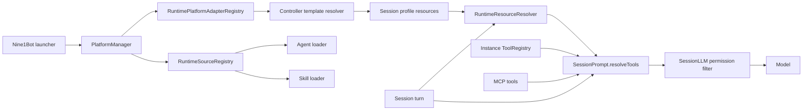
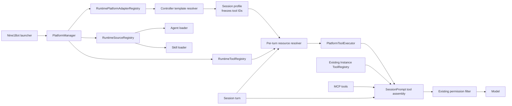
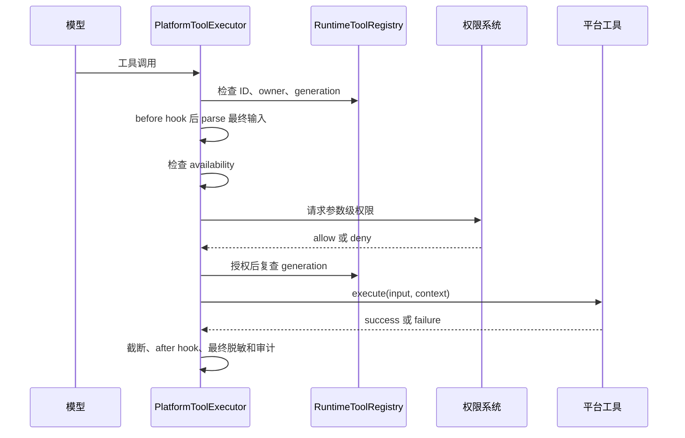

# 平台专属工具注册设计

日期：2026-08-10

状态：待用户审阅

实施基线：`main@ed05b9caef4be4198ecd684b8d9ec048d55e796b`

适用范围：Nine1Bot 单进程部署中的内置平台包、统一平台适配层、Controller session profile、OpenCode 工具解析与执行链路

## 1. 目标与边界

Nine1Bot 现有平台协议已经允许平台贡献 runtime adapter、agent source、skill source、模板上下文以及 MCP、skill 和内置工具资源声明，但平台包不能向 Agent runtime 注册新的可执行工具。平台只能声明已有内置工具 ID，无法提供自己的 schema、权限映射、可用性检查和执行逻辑。

本次改造要让受信任的内置平台包注册平台专属工具，并让统一 runtime 决定这些工具何时进入 session、何时对模型可见、是否有权执行以及失败后如何审计。完成后应满足以下结果：

1. 平台通过显式 API 注册工具定义，通过资源贡献显式声明 session 可以使用哪些工具；注册本身不会让工具自动出现在模型上下文中。
2. Session 创建时只冻结工具 ID。每轮解析和实际执行前仍检查平台启用状态、认证、冲突、权限和注册 generation。
3. 平台工具复用现有 Agent 权限、工具 hook、资源失败事件和结果截断能力，平台实现不能绕过统一执行入口。
4. 平台启用、重载和停用以 owner 为单位管理，单个非法定义不会造成半注册，旧调用不能误用新的平台配置。
5. 未注册或未声明平台工具时，现有 agent、skill、MCP、原生工具和已有 session 行为保持不变。

第一版只接受与 Nine1Bot 一起编译和发布的内置平台包。动态第三方加载、进程沙箱和具体平台业务工具不在本设计范围内。

现有 `builtinTools.enabledGroups` 和 `enabledTools` 的实际过滤语义也不在本次改造范围内。平台注册工具使用独立的 `registeredTools` 解析路径，避免顺带扩大为内置工具分组重构。

## 2. 当前源码与问题

### 2.1 当前平台注册链路

Nine1Bot 在 OpenCode server 开始监听前调用 `registerBuiltinPlatformAdapters()`。`PlatformManager` 随后把 adapter 放入 `RuntimePlatformAdapterRegistry`，把 agent 和 skill source 放入 owner-aware 的 `RuntimeSourceRegistry`。这一顺序保证首个请求能看到已经注册的平台贡献。



当前实现的可复核入口如下：

| 当前职责 | 源码入口 | 当前行为 |
|---|---|---|
| 启动顺序 | `packages/nine1bot/src/launcher/server.ts:180` | 内置平台在 `OpencodeServer.listen()` 之前注册。 |
| 平台协议 | `packages/platform-protocol/src/index.ts:208` | `runtime` 只定义 `createAdapter` 和 agent/skill `sources`。 |
| 平台资源贡献 | `packages/platform-protocol/src/index.ts:254` | Adapter 只能根据 `templateIds` 贡献 `builtinTools`、MCP 和 skills。 |
| 平台启停 | `packages/nine1bot/src/platform/manager.ts:263` | 启用时依次注册 adapter 和 runtime source；停用时移除 source owner。 |
| 配置替换 | `packages/nine1bot/src/platform/manager.ts:225` | 当前先注销旧 runtime 再重建记录，不提供本设计要求的最后成功快照。 |
| Source 生命周期 | `opencode/packages/opencode/src/runtime/source/registry.ts:1` | Registry 按 owner 保存 source，支持 unregister 和 revision。 |
| Agent 可见性 | `opencode/packages/opencode/src/agent/agent.ts:430` | 平台 Agent 已有 `declared-only`、`recommendable` 和 `user-selectable` 过滤。 |
| Skill 可见性 | `opencode/packages/opencode/src/skill/skill.ts:344` | 平台 Skill 已有 `default` 和 `declared-only` 过滤。 |

### 2.2 当前工具链路

`ToolRegistry` 使用 `Instance.state()` 加载原生、项目和 plugin 工具。它提供的 `register()` 只按 ID 替换当前 Instance 中的 custom 数组，没有 owner、批量原子注册、unregister、revision、generation 或 catalog visibility。`SessionPrompt.resolveTools()` 枚举这些工具和 MCP 工具并包装前后置 hook，`SessionLLM` 最后根据用户开关和 Agent 的整工具权限过滤。

上图中的工具支路体现了当前边界：资源解析结果会影响 MCP 和 skill 输入，但平台没有可执行工具定义目录；原生、项目和 plugin 工具仍由 Instance 级 `ToolRegistry` 直接枚举。

当前工具相关入口如下：

| 当前职责 | 源码入口 | 设计影响 |
|---|---|---|
| 工具存储 | `opencode/packages/opencode/src/tool/registry.ts:59` | Registry 按 Instance 缓存，不能从进程级 `PlatformManager` 直接管理平台生命周期。 |
| 工具注册 | `opencode/packages/opencode/src/tool/registry.ts:115` | 同 ID 直接替换，不能表达 owner 冲突或卸载。 |
| 工具枚举 | `opencode/packages/opencode/src/tool/registry.ts:185` | 只执行少量模型相关过滤，没有平台资源声明过滤。 |
| Session 组装 | `opencode/packages/opencode/src/session/prompt.ts:1281` | 原生和 MCP 工具在这里转换为模型工具并执行 hook。 |
| 整工具权限 | `opencode/packages/opencode/src/session/llm.ts:277` | 用户关闭或 Agent hard deny 的工具在发送模型前删除。 |
| 资源解析 | `opencode/packages/opencode/src/runtime/resource/resolver.ts:168` | 当前只解析 MCP 和 skills；`builtinTools` 只随结果传递。 |
| Profile 合并 | `opencode/packages/opencode/src/runtime/controller/template-resolver.ts:284` | 模板贡献和 session choice 目前只合并内置工具、MCP 和 skills。 |

因此，本次改造不能简单复用 `ToolRegistry.register()`。平台注册需要一个进程级、owner-aware 的定义目录，具体项目和 session 仍然在现有 Instance 上下文内完成解析和执行。

## 3. 目标架构与固定决策

### 3.1 目标调用链

目标架构保留当前 adapter、source、session profile、权限和工具 hook，只增加平台工具定义目录、资源声明和统一执行器。



平台注册路径和 session 声明路径保持分离：

- `runtime.tools` 提供“这个平台实现了哪些工具”。
- `resourceContributions` 和 `sessionChoice` 提供“这个 session 声明了哪些工具”。
- `availability` 和权限系统提供“本轮是否可以看见和执行”。

### 3.2 已确认决策

| 主题 | 固定结论 |
|---|---|
| 信任边界 | 第一版只运行随 Nine1Bot 编译发布的内置平台包，工具在主进程内执行。 |
| 默认行为 | 注册工具不会自动启用；默认资源池不继承平台工具。 |
| Catalog 可见性 | 工具必须声明为 `declared-only` 或 `user-selectable`，不提供隐式默认值。 |
| Session 生命周期 | Session 创建时冻结工具 ID；新注册工具不会热注入已有 session。 |
| 动态状态 | 平台启停、认证、健康状态和冲突每轮重新解析，执行前再次检查。 |
| 资源合并 | 平台工具与现有资源一样使用 `session` 生命周期和 `additive-only` 合并。 |
| 权限 | Template 和资源选择只能增加声明，不能授予权限；执行统一进入现有权限系统。 |
| 冲突 | 跨平台 owner 的 ID 冲突拒绝后注册的整组工具；平台工具绝不覆盖原生、项目、plugin 或 MCP 工具。 |
| 注册一致性 | 同一 owner 的工具组全部验证通过后才能发布；同 owner 成功替换时递增 generation。 |
| 重载失败 | 已有平台保留最后一次成功快照并进入 `degraded`；首次启用失败时不发布 runtime contribution。 |
| 显式停用 | 平台 owner 立即失效并递增 generation，然后移除 adapter、source 和工具。 |
| Schema 演进 | 兼容修改可以沿用 ID；破坏性 schema 或语义变更必须使用新 ID，例如 `_v2`。 |
| 输出 | 第一版只支持文本 `output` 和经过清洗的 `metadata`，不支持文件、图片和二进制流。 |
| 超时 | Runtime 对平台工具施加默认上限和硬上限，并把取消信号传入平台实现。 |

### 3.3 方案选择理由

| 方案 | 结论 | 原因 |
|---|---|---|
| 显式注册定义，并显式声明 session 工具 ID | 采用 | 注册、选择和运行状态各有一个清晰入口，能复用现有 profile 和权限模型。 |
| 让平台提交一套通用 selector DSL | 不采用 | 第一版只有受信任内置包，DSL 会重复实现条件、校验和调试系统，却仍无法承载执行函数。 |
| 给每个工具提供任意 `isVisible()` 回调 | 不采用 | 可见性会难以审计和复现，也容易把 catalog、session 声明和实时 availability 混成一个判断。 |
| 直接调用现有 `ToolRegistry.register()` | 不采用 | 它按 Instance 存储且没有 owner、卸载、revision 和 generation，无法满足平台生命周期。 |

## 4. 平台协议

### 4.1 注册入口

`PlatformAdapterContribution.runtime` 增加可选 `tools` provider。Provider 在平台注册或重载的准备阶段执行，可以通过 `PlatformAdapterContext` 捕获平台配置、secret store 和共享 service，但返回值本身不能序列化或写入 session。

```ts
export type AnyPlatformToolDefinition = PlatformToolDefinition<any>

export type PlatformRuntimeToolsProvider =
  | AnyPlatformToolDefinition[]
  | ((ctx: PlatformAdapterContext) => AnyPlatformToolDefinition[])

export type PlatformAdapterContribution = {
  descriptor: PlatformDescriptor
  runtime?: {
    createAdapter: (ctx: PlatformAdapterContext) => PlatformRuntimeAdapter
    sources?: PlatformRuntimeSourcesProvider
    tools?: PlatformRuntimeToolsProvider
  }
  // 其他现有字段保持不变
}
```

第一版 provider 必须同步返回定义。平台网络客户端、认证缓存和后台状态监听器由 adapter 或 platform service 管理；工具 provider 不创建独立后台任务，也不拥有单独的 dispose 生命周期。

### 4.2 工具定义

平台协议不直接依赖 OpenCode 使用的 Zod 版本。工具同时提供模型可见的 JSON Schema 和 runtime 强制执行的 `parse()`，由 parser 产出 `execute()` 使用的类型化输入。

```ts
export type PlatformToolDefinition<TInput = unknown> = {
  id: string
  description: string
  catalogVisibility: 'declared-only' | 'user-selectable'
  inputSchema: Record<string, unknown>
  parse: (input: unknown) => TInput
  permission?: (input: TInput) => PlatformToolPermissionRequest
  availability?: (
    ctx: PlatformToolResolveContext,
  ) => PlatformToolAvailability | Promise<PlatformToolAvailability>
  execution?: {
    timeoutMs?: number
  }
  execute: (
    input: TInput,
    ctx: PlatformToolCallContext,
  ) => Promise<PlatformToolResult>
}

export type PlatformToolPermissionRequest = {
  permission: string
  patterns: string[]
  always?: string[]
}

export type PlatformToolResolveContext = {
  sessionId: string
  projectId?: string
  directory: string
  agent: string
  templateIds: string[]
}

export type PlatformToolCallContext = PlatformToolResolveContext & {
  messageId: string
  callId?: string
  signal: AbortSignal
  reportProgress: (progress: {
    title?: string
    metadata?: Record<string, unknown>
  }) => Promise<void>
}
```

工具 ID 必须匹配 `^[a-z][a-z0-9_]*$`，并以平台 ID 为前缀，例如 `feishu_search_docs`。`description` 和 `inputSchema` 会进入模型上下文，因此不能包含配置、凭据或仅供服务端使用的内部信息。

Registry 使用标准化 owner 前缀校验 ID：把 owner ID 转成小写，并把非字母数字字符替换成下划线后，工具 ID 必须以 `${ownerPrefix}_` 开头。标准化后的 owner 前缀本身必须匹配工具 ID 的首段规则，而且不能与另一个 owner 的前缀重复。这样 session profile 即使只保存工具 ID，也不会在 owner 注销或进程重启后被另一个 owner 接管。

注册校验至少包括：ID 与 owner 前缀、非空 description、合法 JSON Schema 对象、必填 parser 和 execute、明确 catalog visibility、timeout 范围、同组重复以及跨 owner 冲突。任何一项失败都拒绝整个 owner 工具组。JSON Schema 负责模型提示和第一层格式校验，`parse()` 是运行时权威校验；两者无法自动证明完全等价，因此每个生产工具必须用同一组有效和无效样例测试二者的一致性。

未提供 `permission()` 时，执行器使用以下默认请求：

```ts
{
  permission: tool.id,
  patterns: ['*'],
}
```

`availability()` 返回与现有资源状态一致的结果：

```ts
export type PlatformToolAvailability = {
  status: 'unknown' | 'available' | 'degraded' | 'unavailable' | 'auth-required'
  reason?: string
  checkedAt?: number
  error?: string
  action?: {
    type: 'open-settings' | 'start-auth' | 'retry'
    label: string
  }
}
```

Availability 只检查本地配置、认证缓存和平台后台 service 已知状态。Resolver 并行执行本轮已声明工具的检查，并对整组检查使用共享的 500 毫秒预算；未在预算内完成的工具按 `unknown` 处理。真正的远程 API 请求放在 `execute()` 中，避免每轮工具枚举触发外部调用。未提供 `availability()` 时，只要 owner active 且没有冲突，工具按 `available` 处理。

Availability 超时允许工具以 `unknown` 进入模型，并在调用时再次检查。Callback 抛出异常或返回非法结构时，catalog 将它标记为 `degraded`；如果调用前复查仍然异常，执行器返回 `availability-check-failed` 并且不进入平台实现。

### 4.3 执行结果

工具必须返回结构化结果。业务失败不通过任意异常文本直接暴露给模型；执行器会把未捕获异常转换为 `execution-failed`。

```ts
export type PlatformToolResult =
  | {
      status: 'ok'
      title: string
      output: string
      metadata?: Record<string, unknown>
    }
  | {
      status: 'failed' | 'unavailable' | 'auth-required'
      code: string
      message: string
      recoverable: boolean
      action?: {
        type: 'open-settings' | 'start-auth' | 'retry'
        label: string
      }
    }
```

### 4.4 资源声明

平台 adapter 的资源贡献输入增加当前 entry 和最终选定 Agent，让平台可以用显式条件决定哪些工具进入 session profile。Controller 必须先解析 session choice、默认 Agent 和平台推荐结果，再使用最终生效的 Agent 名称计算资源贡献，避免 Agent 条件与实际运行对象不一致。

```ts
export type PlatformResourceContributionInput = {
  templateIds: string[]
  entry?: PlatformTemplateInput['entry']
  agentName: string
}

export type PlatformRegisteredToolResourceSpec = {
  tools: string[]
  lifecycle: 'session'
  mergeMode: 'additive-only'
  availability?: Record<string, PlatformResourceAvailability>
}

export type PlatformResourceContribution = {
  builtinTools: {
    enabledGroups?: string[]
    enabledTools?: string[]
  }
  registeredTools?: PlatformRegisteredToolResourceSpec
  mcp: {
    servers: string[]
    tools?: Record<string, string[]>
    lifecycle: 'session'
    mergeMode: 'additive-only'
    availability?: Record<string, PlatformResourceAvailability>
  }
  skills: {
    skills: string[]
    lifecycle: 'session'
    mergeMode: 'additive-only'
    availability?: Record<string, PlatformResourceAvailability>
  }
}
```

Runtime 的 owner-neutral `ResourceSpec` 同样增加 `registeredTools`，以便未来其他受信任 capability 复用这条链路；第一版只有平台包能够注册定义。

```ts
export type ResourceSpec = {
  builtinTools: BuiltinToolSpec
  registeredTools?: RegisteredToolResourceSpec
  mcp: McpResourceSpec
  skills: SkillResourceSpec
}

export type RegisteredToolResourceSpec = {
  tools: string[]
  lifecycle: 'session'
  mergeMode: 'additive-only'
  availability?: Record<string, ResourceAvailability>
}
```

`RuntimeControllerProtocol.ResourceSelection` 增加可选 session choice：

```ts
registeredTools?: {
  tools?: string[]
}
```

这是一项兼容的 `agent-runtime/v1` 可选扩展，不提升协议主版本。Server capability 增加 `registeredTools: true`；支持资源选择的客户端据此展示平台工具，旧客户端继续忽略未知 capability 和资源字段。

资源合并顺序为默认用户资源、平台模板贡献、session choice，最后去重写入 profile。`registeredTools` 只能增加 ID，不能删除模板声明；Agent 权限仍可以拒绝执行。平台 adapter 只能贡献属于自身 owner 的工具，session choice 只能选择当前标记为 `user-selectable` 的工具；直接提交 `declared-only` ID 必须被拒绝，不能依赖 UI 隐藏来维持边界。

Profile 只保存 ID 和声明时的 availability 摘要，不保存工具定义、schema、generation、client、配置或凭据。声明时的 availability 只用于审计和首屏提示，每轮 `availability()` 结果才是当前可用性的权威判断，因此旧 session 可以在认证恢复后自动重新使用工具。协议输入允许省略 `registeredTools`，runtime 进入合并和解析前一律把它规范化为空资源结构。

Controller 的 template audit、resources preview、turn `AuditSpec.resources` 和 `runtime.resources.resolved` 事件都增加 registered tool ID 列表，使“声明了什么”和“本轮解析出什么”可以分别核对。

## 5. Runtime 组件与生命周期

### 5.1 组件职责

| 组件 | 主要职责 | 依赖边界 |
|---|---|---|
| `PlatformManager` | 解析 provider，准备并提交平台 runtime 快照，发布平台状态。 | 依赖 platform protocol、adapter registry、source registry 和 tool registry。 |
| `RuntimeToolRegistry` | 按 owner 保存不可变工具定义、generation、revision 和卸载 tombstone。 | 不依赖项目 Instance、session 或 UI。 |
| `RuntimeResourceResolver` | 根据 profile ID 解析当前定义、availability、冲突和失败。 | 读取 registry，不直接执行平台工具。 |
| `PlatformToolExecutor` | 统一完成 parse、权限、generation、超时、执行、结果清洗和审计。 | 复用现有 Permission、plugin hook、Bus 和 Truncate 能力。 |
| Catalog/诊断 API | 返回可序列化摘要和不可用原因。 | 不暴露定义函数、原始 schema、配置或凭据。 |

现有 `ToolRegistry` 继续管理原生、项目和 plugin 工具。平台定义不写入其 `custom` 数组；`SessionPrompt.resolveTools()` 在当前 Instance 上下文中分别取得现有工具、平台工具和 MCP 工具，然后做最终冲突检查和统一包装。

### 5.2 RuntimeToolRegistry

Registry 以 owner ID 为批量更新单位，并提供以下行为：

- `registerOwner()` 或 `replaceOwner()` 先验证完整定义集合，再一次性发布。
- 工具 ID 在同一 owner 内重复时整组失败。
- 工具 ID 已被其他 owner 使用时，后注册的整组失败。
- Owner 第一次成功注册使用 generation 1；同 owner 成功替换或注销时 generation 单调递增，失败的准备阶段不改变 generation。任何可见目录变化同时递增全局 revision。
- `unregisterOwner()` 使 owner 立即不可解析，并保留 generation tombstone 和该 owner 历史工具 ID 集合。进程生命周期内，其他 owner 不能认领 tombstone 中的 ID；同 owner 重新启用时可以重新使用。
- `listOwner()` 和 catalog 查询返回克隆后的摘要，不能让调用方修改内部快照。
- 测试环境提供清理入口，语义与现有 `RuntimeSourceRegistry.clearForTesting()` 一致。

原生、项目、plugin 和 MCP 工具只有在具体 Instance 组装时才能完整枚举，因此这类冲突在每轮最终组装时检查。发生冲突时保留现有工具并过滤平台工具，同时发布可诊断失败；平台工具不能覆盖任何已有实现。

### 5.3 启用、重载和停用

平台 runtime 更新分为准备和提交两个阶段：

1. 准备阶段构造 adapter、source descriptor 和工具组，完成所有同步校验，但不修改当前生效快照。
2. 提交阶段不执行异步等待，在同一个短事务中替换 adapter、source owner 和 tool owner，并发布新的 applied revision。
3. 如果提交过程中出现异常，Manager 使用旧快照回滚本次修改，不能留下部分新 contribution。

`createAdapter`、source provider 和 tool provider 在准备阶段不能启动后台任务或产生不可回滚的外部副作用。Background service 继续由 PlatformManager 在提交成功后按现有生命周期启动。

首次启用的准备阶段失败时，不发布该平台的 adapter、source 或工具，平台状态为 `error`。已有平台重载失败时继续运行最后一次成功快照，平台状态为 `degraded`，并分别记录 desired config revision 和 applied config revision。缺少用户认证属于 runtime availability，不属于定义注册失败。

显式停用采用失效优先顺序：先把 owner 标记为不可用并递增 generation，再移除 adapter、source 和工具。已经开始执行的调用不会因配置重载被强制终止，但仍响应 session `AbortSignal`；等待权限但尚未执行的调用会在 generation 复查时失败。

关闭 Nine1Bot 时按同一规则注销 owner。平台共享 client 和后台 service 沿用现有 PlatformManager 生命周期，工具定义没有单独的后台资源。

## 6. 可见性与每轮解析

工具是否进入模型由三个独立层次决定：

| 层次 | 配置位置 | 回答的问题 |
|---|---|---|
| Catalog 可见性 | `catalogVisibility` | 普通资源选择器是否展示该工具。 |
| Session 声明 | template、entry、agent contribution 或 session choice | 当前 session profile 是否包含该工具 ID。 |
| Runtime 可用性 | owner 状态、availability、冲突和权限 | 本轮是否发送模型以及调用时是否允许执行。 |

平台要把工具限制在特定 Agent 时，应使用 `declared-only` 并根据 `agentName` 贡献；`user-selectable` 表示当前 catalog 中的 Agent 都可以选择，最终仍受该 Agent 的权限规则限制。

每轮解析按以下顺序执行：

1. 从 session profile 读取已声明工具 ID。
2. 在 `RuntimeToolRegistry` 中解析 owner、当前定义和 generation。
3. 检查 owner 是否启用、工具是否冲突以及 availability 是否允许暴露。
4. 始终使用工具 ID 作为 exposure permission key，对整工具 hard deny 做发送模型前过滤。
5. 将通过检查的工具加入 `SessionPrompt` 工具集合。
6. 调用发生后检查 generation，并执行 `tool.execute.before` hook。
7. 使用 hook 修改后的最终参数执行 `parse()`、availability 和参数级权限校验。
8. 等待用户授权后再次校验 generation，再进入平台 `execute()`。
9. 规范化并截断结果后执行 `tool.execute.after` hook，再做最终脱敏和大小检查后返回模型。



精确可见性语义如下：

| 状态 | 模型可见性 | 诊断行为 |
|---|---|---|
| 已注册但未声明 | 不可见 | 不产生 session 失败。 |
| 已声明且 available | 可见 | 记录 owner、generation 和声明来源。 |
| 已声明但 owner 已注销 | 不可见 | 产生 `tool-missing` 或平台停用失败。 |
| 已声明但缺少认证 | 不可见 | 产生 `auth-required`，附认证操作。 |
| availability 为 degraded 或 unknown | 可见 | 带状态进入审计；远程失败由执行结果处理。 |
| Agent 对整个工具 hard deny | 不可见 | 复用现有权限过滤，不产生资源故障。 |
| 权限需要 ask | 可见 | 调用时进入现有权限交互。 |
| 与已有工具冲突 | 不可见 | 保留已有工具并产生 `tool-conflict`。 |

旧 session 保留声明 ID。平台停用后这些 ID 解析为不可用；平台以后用相同 ID 重新启用时，旧 session 可以在下一轮重新使用当前定义。破坏性语义变化必须改用新 ID，防止旧 profile 意外接入不兼容实现。

## 7. 权限与安全边界

### 7.1 中央权限控制

平台实现只能提供权限请求所需的 permission 名称和资源 patterns，最终决策由现有 Agent permission、session grant 和用户交互完成。Template、资源贡献、平台配置和工具定义都不能直接声明 `allow`。

参数级权限在 `parse()` 成功后计算。例如读取指定文档的工具可以把文档 ID 映射为 pattern；用户拒绝该 pattern 时不执行远程请求。`permission()` 抛出异常、返回空 patterns 或返回非法值时按拒绝处理。

每个平台注册工具始终使用 `tool.id` 作为 exposure permission key，因此按工具 ID 配置 hard deny 可以在发送模型前过滤，并作为运行时紧急开关。未提供 `permission()` 时，调用权限也使用 `tool.id` 和 `*`；自定义 `permission()` 只替换调用阶段的 permission key 和 patterns。授权等待结束后必须复查 exposure deny 和 generation，避免用户确认的是旧定义，实际执行的却是新配置。

平台工具的 before hook 可以沿用现有参数改写能力，但 parser 和权限计算必须使用 hook 完成后的最终参数；否则 plugin 改写资源 ID 后可能沿用改写前的授权结果。平台工具实现只接收已经完成 parser 和权限校验的输入。

### 7.2 Secret 与上下文

平台配置、token 和 SDK client 由 `runtime.tools(ctx)` 创建的闭包持有。模型只接收工具 ID、description 和 JSON Schema；session profile、工具结果、metadata、资源事件和审计日志都不能包含 secret、cookie、Authorization header 或未清洗的 SDK 原始响应。

调用上下文只提供执行所需的 session、项目目录、Agent、模板、消息、call ID、取消信号和进度回调。平台工具不能直接获得整个 Session 对象或任意 Manager 内部状态。

### 7.3 超时、取消和并发

工具没有声明 `execution.timeoutMs` 时默认限制为 60 秒；声明值必须是正整数，且不能超过 5 分钟。有效超时取工具限制、5 分钟 runtime 硬上限以及当前 turn 剩余 deadline 中的最小值。执行计时在权限通过并完成 generation 复查后开始，不把用户等待授权的时间算入 60 秒，但显式 turn deadline 始终可以终止等待。执行器创建派生的 `AbortSignal` 并把它传给平台实现；平台必须继续把信号传入 HTTP 和 SDK 调用。

第一版在主进程内运行受信任代码，JavaScript 无法强制终止忽略取消信号的 Promise，也无法撤销已经产生的外部副作用。因此平台工具必须异步、可重入并遵守取消信号，不能执行无界同步计算。共享 service 负责平台 API 自身的限流和并发控制；第一版不增加通用平台工具队列。

### 7.4 输出与审计

执行器对成功和失败结果执行以下统一处理：

- 复用 `Truncate.output()` 限制模型可见文本，超限内容使用现有落盘和引用语义；after hook 返回后再执行最终检查，不能通过 hook 绕过限制。
- 成功结果和 `reportProgress()` 的 metadata 序列化后分别限制为 32 KiB，并移除常见 credential、cookie 和 authorization 字段。
- 继续触发 `tool.execute.before` 和 `tool.execute.after` hook。
- 审计只记录 owner、tool ID、generation、声明来源、权限结果、耗时、状态和失败码。
- 默认不记录原始输入、原始输出或远程响应；平台可以通过受控 metadata 提供非敏感诊断字段。

## 8. 错误、事件与管理状态

### 8.1 统一错误码

Runtime 第一版固定以下保留错误码：

```text
tool-missing
tool-conflict
auth-required
stale-generation
invalid-input
availability-check-failed
permission-resolution-failed
permission-denied
execution-failed
execution-timeout
cancelled
```

平台业务失败可以返回自己的稳定 code，但必须使用 owner 前缀，例如 `feishu-document-not-found`，不能复用或改变 runtime 保留错误码的含义。

错误进入不同的现有通道，避免把用户权限拒绝误报成平台故障：

| 场景 | 模型或调用行为 | 事件与状态 |
|---|---|---|
| 工具定义非法或 owner ID 冲突 | 工具组不发布。 | 平台 runtime 状态为 `error` 或 `degraded`，写注册审计。 |
| 已声明工具不存在或平台停用 | 不发送模型。 | `runtime.resource.failed` 使用 `resourceType: tool`、`stage: resolve`。 |
| 缺少认证 | 不发送模型。 | `stage: auth`，附 `open-settings` 或 `start-auth`。 |
| 输入不符合 parser | 返回可重试的工具参数错误。 | 记录 `invalid-input`，不标记整个平台不可用。 |
| Availability 或权限 resolver 非法 | 不执行平台工具。 | 记录 `availability-check-failed` 或 `permission-resolution-failed`，按失败关闭。 |
| 权限被拒绝 | 不执行。 | 复用现有 Permission 事件，不产生 resource failure。 |
| Generation 已变化 | 拒绝旧调用。 | 记录 `stale-generation`，下一轮重新解析。 |
| 执行失败或超时 | 返回脱敏后的结构化失败。 | `stage: execute`，记录对应执行错误码。 |
| 与现有工具重名 | 平台工具不进入模型。 | 记录 `tool-conflict`，不覆盖现有工具。 |

`RuntimeResourceResolver.Failed`、`ResolvedEvent`、resolved audit 和 `AuditSpec.resourceFailures` 都需要把 `tool` 加入资源类型。工具 failure 事件另外携带可选的 `ownerID`、`generation` 和 `code`。相同 session、tool ID、generation 和错误码只通知一次；状态改变后允许再次通知，避免每轮重复刷出同一错误。

### 8.2 Catalog 与平台详情

管理 API 只返回可序列化摘要：

```ts
export type PlatformToolSummary = {
  id: string
  ownerId: string
  description: string
  catalogVisibility: 'declared-only' | 'user-selectable'
  status: 'registered' | 'unavailable' | 'auth-required' | 'conflict' | 'error'
  generation: number
  unavailableReason?: string
}
```

平台详情可以展示该平台的全部工具。普通资源选择器只展示 active owner 的 `user-selectable` 工具；`declared-only` 只能由平台 template、entry 或 agent contribution 声明。缺少认证的 user-selectable 工具可以在选择器中显示为不可用并提供认证入口，但不会发送给模型。用户改变选择只影响随后创建的 session，不修改已有 profile。

`status` 是带 resolve context 的 catalog 结果：查询必须提供当前 directory、Agent 和模板，才能判断项目 plugin、MCP、认证和 session 相关冲突。没有项目上下文的平台管理摘要只报告注册状态和 generation，不把尚未解析的工具误报为全局 conflict。

`PlatformManager.getDetail()` 在现有 `runtimeSources` 摘要旁增加静态 `runtimeTools` 注册摘要；带项目上下文的 catalog resolver 再补充 availability 和 conflict。Session 调试信息显示工具 ID、声明来源、解析状态和 generation，不显示输入、输出、schema 实现、client 或凭据。第一版只接入现有平台详情和资源选择流程，不新增独立工具市场。

## 9. 兼容、发布与回滚

### 9.1 兼容要求

- `runtime.tools`、`registeredTools` 和 session choice 新字段全部可选；没有工具贡献的平台行为不变。
- `emptyResources()` 和旧 profile 缺少 `registeredTools` 时按空集合处理。
- 平台工具不进入默认资源池，因此升级本身不会改变模型工具列表。
- 已有 session 不自动获得新工具；只有新建或已明确声明相同 ID 的 session 会解析平台工具。
- Agent、skill、MCP 和原生工具的原有可见性、权限及加载顺序保持不变。
- 新协议 decoder 必须容忍字段缺失；回退版本读取含新字段的 profile 时应安全忽略未知字段，不损坏 session。
- 工具函数、schema、generation、配置和凭据不持久化，因此不需要数据库迁移。
- 平台工具代码继续作为内置平台包的一部分打包，不增加动态包下载或运行时模块发现。

### 9.2 回滚方式

运行中出现问题时按影响范围选择回滚：

1. 在现有权限规则中按工具 ID 设置 hard deny，可以立即阻断新调用，包括旧 session。
2. 移除平台资源贡献后，新 session 不再声明该工具。
3. 注销 tool owner 会让所有保留该 ID 的旧 profile 统一解析为不可用。
4. 显式停用平台会同时移除 adapter、source 和工具。
5. 回退到不支持平台工具的构建时，optional profile 字段被忽略，不需要数据修复。

重载失败保留最后成功快照可能让旧凭据继续存在于进程内。平台详情必须明确显示 desired 和 applied revision；如果配置变更涉及撤权，操作者应先使用权限 hard deny 或显式停用平台，再处理配置错误。

## 10. 测试与验收

### 10.1 自动化测试矩阵

| 测试层 | 必须覆盖的行为 |
|---|---|
| Platform protocol | 工具 ID、必填 parser、visibility、timeout、结果和 `registeredTools` 类型。 |
| Runtime registry | owner 原子注册、同组重复、跨 owner 冲突、generation、revision、unregister tombstone、历史 ID 不可被其他 owner 接管。 |
| Platform manager | 首次启用、成功重载、失败重载保留旧快照、首次失败不发布、显式停用立即失效。 |
| Resource resolver | 声明合并、平台只能声明自身工具、session choice 拒绝 `declared-only`、并发 availability 预算、认证缺失、事件扩展和去重。 |
| Session tool assembly | 与原生、项目、plugin、MCP 的冲突优先级，以及 plugin hook 保持。 |
| Executor | parser、permission allow/ask/deny、授权期间重载、超时、取消、截断、metadata 清洗和异常脱敏。 |
| Session 生命周期 | 新旧 session 差异、平台停用与同 ID 恢复、破坏性版本使用新 ID。 |
| API/UI | 工具摘要、声明来源、不可用原因和认证入口，不泄露函数、schema 内部信息或凭据。 |

基础设施改动使用测试平台 adapter 做完整链路验证，不在同一提交中新增 Feishu 或 GitLab 生产业务工具。这样可以单独证明注册机制、权限和生命周期正确，具体业务工具以后按各自 API、副作用和认证要求独立评审。

### 10.2 关键端到端场景

1. 平台启用、工具已声明且 available 时，模型只收到一次该工具并能成功调用。
2. 工具已注册但未声明时，模型看不到；`declared-only` 也不会出现在普通选择器。
3. 用户等待授权期间平台被停用或成功重载，旧 generation 不会执行。
4. 平台停用后，旧 session 保留 ID 但解析为不可用；使用同一 ID 重新启用后下一轮恢复。
5. 两个 owner 注册同一 ID 时，后注册的整组失败，不覆盖先注册 owner。
6. Owner 注销后，其他 owner 仍不能接管 tombstone 中的历史 ID；原 owner 可以按新 generation 恢复。
7. 客户端手工提交 `declared-only` ID 时请求被拒绝，不能绕过 catalog visibility。
8. 平台工具与原生、项目、plugin 或 MCP 工具重名时，平台工具被过滤。
9. 缺少认证时，管理界面显示认证操作，模型不接收工具。
10. 执行超时、异常和输出过大时，模型获得可处理的脱敏结果，日志中没有 token 或原始响应。

### 10.3 验证命令

实现完成后至少运行：

```powershell
bun run ci:typecheck
bun run ci:test
bun run build:web

cd opencode/packages/opencode
bun test test/platform test/resource test/controller test/tool
bun run typecheck
```

还要启动 Nine1Bot，使用测试 adapter 人工验证注册、声明、选择、调用、授权等待期间重载、平台停用、认证缺失和错误提示。发布构建继续运行现有 `scripts/test-startup.sh` smoke test，确保平台工具代码随内置平台包正确打包。

### 10.4 验收标准

- [ ] 平台可以注册一组带 schema、parser、权限、availability、timeout 和 execute 的工具定义。
- [ ] 未声明工具永远不会进入模型，catalog visibility 和模型可见性互不混淆。
- [ ] 平台 contribution 不能声明其他 owner 的工具，session choice 不能选择 `declared-only` 工具。
- [ ] Session profile 只冻结 ID，每轮和执行前都使用当前 owner 状态与 generation。
- [ ] 平台工具不能覆盖任何现有工具，也不能绕过 Agent 权限。
- [ ] 启用、重载、停用和失败回滚没有半注册或新旧配置混用窗口。
- [ ] 超时、取消、结果限制、hook、资源事件和审计均经过统一执行器。
- [ ] API、UI、日志和模型上下文中没有平台凭据或未清洗的原始响应。
- [ ] 未使用平台工具的现有平台、session 和工具链测试保持通过。
- [ ] 测试 adapter 证明完整链路；生产平台业务工具仍保持独立提交边界。

## 11. 实施分段与延期项

后续实施计划应按以下依赖顺序拆分：

1. 扩展 platform protocol、`ResourceSpec` 和 controller selection 类型。
2. 增加 owner-aware `RuntimeToolRegistry` 及原子生命周期测试。
3. 增加 resolver、executor、权限和错误事件接入。
4. 让 PlatformManager 使用准备/提交事务注册 adapter、source 和工具。
5. 接入 SessionPrompt、catalog、平台详情和现有资源选择器。
6. 使用测试 adapter 完成端到端验证和发布 smoke test。

第一版明确延期：

- 动态第三方工具包、远程下载和进程沙箱；
- 图片、文件和流式二进制结果；
- 任意 JavaScript 可见性表达式或 selector DSL；
- 向已有 session 热注入新的工具 ID；
- 工具自有后台任务和独立 dispose 生命周期；
- 跨进程 registry、分布式 generation 和通用平台工具并发队列；
- 与具体 Feishu、GitLab 业务 API 绑定的生产工具。

本设计通过用户书面审阅前，不进入实施计划或代码修改。用户确认本 spec 后，下一步单独编写文件级实施计划。
