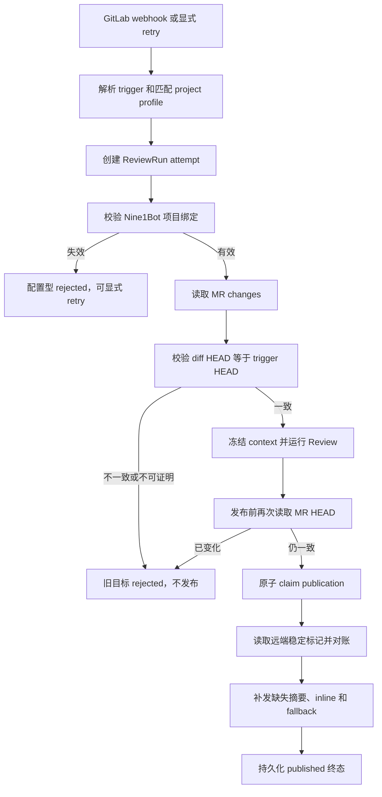

# GitLab Review 二次审查加固设计

## 1. 文档状态

- 状态：实施完成；外部 self-managed GitLab 联调待人工执行
- 日期：2026-08-15
- 目标分支：`feat/gitlab-review-workflow`
- 前置设计：`18-review-hardening-and-recovery-design.md`
- 实施范围：`platform-gitlab`、Nine1Bot Review controller/run store、OpenCode 自动化运行时、Web GitLab 配置页
- 复审状态：`cf86409` 已完成初始验证文档提交与推送；本次 follow-up 修复独立 Task 9 review 的三项 Important finding，Fix Round 1 独立复审与 controller 最终 whole-branch review 仍待执行

## 2. 背景

第一轮安全与恢复能力已经建立可信 CI、按需日志、显式 retry、工具白名单和配置诊断，但分支整体复审发现，部分实现只覆盖了正常顺序，没有覆盖真实运行中的并发、崩溃窗口和边界输入。

本轮不扩展产品范围，也不引入 MCP、数据库或模型通用网络能力。目标是修复以下八类问题：

1. coordinator 的通配 deny 会压过具体 task allow，导致 specialist 实际无法调用。
2. 截断的 PEM 和 URL 查询参数中的秘密可能穿过 CI 日志脱敏。
3. MR changes 没有与 webhook source HEAD 建立强一致关系，运行期间 MR 更新后仍可能发布旧结论。
4. Nine1Bot 项目绑定失效发生在 run 接受之后，错误被记为不可恢复的 runtime failure。
5. 发布前检查与多次 GitLab 写入不是原子的，并发和部分失败会产生重复评论。
6. hunk 内以重复 `+` 或 `-` 开头的源码仍可能被误判为 diff 文件头。
7. CI job log 配额和 32 KiB tool 输出存在边界绕过。
8. run store 按单条记录裁剪会留下悬空的 attempt 关系。

## 3. 方案选择

发布链路采用“持久化发布状态机 + GitLab 远端标记对账”。

不采用仅进程内 mutex 的方案，因为 GitLab 请求成功后、run store 落盘前进程可能退出，重启后仍会重复发布。不取消 inline discussion，因为这会降低现有 Review 能力。

GitLab REST API 没有为 Notes 和 Discussions 的创建接口承诺通用幂等键，因此不依赖自定义 `Idempotency-Key` 请求头。系统在评论正文中加入不可见的稳定标记，并在恢复发布前通过受限 Notes/Discussions 读取接口对账：

- <https://docs.gitlab.com/api/notes/>
- <https://docs.gitlab.com/api/discussions/>

## 4. 总体数据流



职责保持现有分层：

- `platform-gitlab` 负责 GitLab API、日志脱敏、diff 行号、发布标记和远端对账。
- `nine1bot` 负责 ReviewRun、发布 claim、payload 一致性、HEAD 生命周期和 retry 语义。
- OpenCode 负责运行目录预检、session 启动和实际 task 权限执行。
- Web 负责阻止不存在的 Nine1Bot 项目绑定被保存。

## 5. 权限判定

### 5.1 规则语义

权限判断必须先按规则优先级计算基础 ruleset 的最终结果，而不是扫描任意历史 deny：

1. 基础 ruleset 最终为 `deny` 时，session grant 不得覆盖。
2. 同一基础 ruleset 中，后出现且更具体的 `task: platform.gitlab.* allow` 可以覆盖前面的 `*: deny`。
3. 未被具体 allow 覆盖的工具继续保持 deny。
4. 工具可见性和执行时 `ctx.ask()` 必须得到一致结果。

### 5.2 验收场景

- coordinator 能调用 `platform.gitlab.risk-qa` 等允许的 specialist。
- coordinator 不能调用非 `platform.gitlab.*` agent。
- session grant 不能把基础最终 deny 的 shell、文件写入或通用网络能力改成 allow。

## 6. CI 日志脱敏

日志仍按“ANSI 清理、秘密识别、UTF-8 字节截断”处理。由于网络读取本身必须有界，脱敏器还必须识别不完整结构：

- `-----BEGIN ... PRIVATE KEY-----` 出现但结束标记未进入读取窗口时，从开始标记到当前输入结尾全部替换。
- URL query 和 fragment 中名称包含 `token`、`password`、`secret`、`api_key`、`access_key`、`client_secret` 等字段时，只替换对应值并保留其余 URL 结构。
- 已有 Authorization、userinfo、JWT、GitLab token、云访问密钥和环境变量规则保持有效。
- 脱敏后的最终 trace 仍不得超过配置的字节上限。

测试必须覆盖结束标记位于读取上限之外的 PEM，以及 `?access_token=...&mode=x`、`#client_secret=...`。

## 7. MR HEAD 与冻结 diff

### 7.1 构建上下文前

对于 live MR review，`GET .../merge_requests/:iid/changes` 返回的 `diff_refs.head_sha` 必须存在且等于 trigger 中冻结的 `headSha`。缺失时返回 `gitlab_review_diff_head_unverified`，不一致时返回 `gitlab_review_head_changed`。

这两种 run 都进入 `rejected` 终态，`recoverable=false`。旧 head 不允许显式 retry；GitLab 对新 head 产生的新 webhook 使用新的 idempotency key 创建新 run。commit review 直接按不可变 commit SHA 获取 diff，不应用 MR HEAD 检查。

### 7.2 发布前

发布前使用受限 MR 元数据接口重新读取 `diff_refs.head_sha`。只有它仍等于 trigger HEAD 时才允许 claim publication。MR 在模型运行期间更新时，旧 run 不发布摘要、discussion 或失败提示，避免旧结论污染新版本。

dry-run fixture 必须显式携带匹配的 `diff_refs.head_sha`，测试数据不绕过生产校验。

## 8. 项目绑定恢复

controller 仍负责 profile 结构和 GitLab identity 匹配；OpenCode 在启动异步 session 前解析 `nine1botProjectID` 对应目录。

目录缺失、项目已删除或目录不可用时：

1. 将刚创建的 attempt 转换为 `status=rejected`。
2. 记录 `error=project_binding_missing`、`rejectionKind=configuration`、`recoverable=true`。
3. 不创建 session，不发送 runtime 消息，也不记录通用 `runtime_start_failed`。
4. 配置修复后，显式 retry 创建新 attempt；原记录保持不变。
5. webhook 和 retry HTTP 响应都返回该稳定拒绝结果。

Web 配置页无论当前项目列表是否为空，都必须验证非空 `nine1botProjectID` 确实存在。项目目录尚未加载或加载失败时禁止保存，不把“空列表”解释为“跳过校验”。

## 9. 发布状态机与远端对账

### 9.1 ReviewRun 字段

ReviewRun 增加可选 `publication`：

```ts
type ReviewRunPublication = {
  state: 'publishing' | 'partial' | 'published'
  claimId?: string
  ownerId?: string
  payloadHash: string
  startedAt?: number
  updatedAt: number
  summaryMarker: string
  completedMarkers: string[]
  error?: string
}
```

旧记录没有该字段时按未发布处理。`payloadHash` 来自规范化 stage result，防止部分发布后使用另一份结果继续同一 run。

### 9.2 原子 claim

`ReviewRunStore.claimPublication()` 在任何网络 await 之前同步完成检查和落盘：

- 已有 `publishedAt` 或 `publication.state=published`：返回 `review_run_already_published`。
- 当前进程已有有效 `publishing` claim：返回 `review_run_publish_in_progress`。
- `partial` 或进程重启遗留的 claim：相同 payload 可以用新 claim 恢复；不同 payload 返回 `review_run_publish_payload_mismatch`。

当前 run store 是单实例文件存储，因此本轮保证单 Nine1Bot 服务进程内的原子 claim。多实例共享同一 JSON 文件不在支持范围内；如果未来需要多实例，必须迁移到带 compare-and-set 的共享存储。

### 9.3 稳定标记

评论正文末尾加入 HTML comment，不影响 GitLab 页面展示：

```text
<!-- nine1bot-review:v1:run=<runId>:kind=summary -->
<!-- nine1bot-review:v1:run=<runId>:kind=inline:key=<findingKey> -->
<!-- nine1bot-review:v1:run=<runId>:kind=fallback -->
```

`findingKey` 由 finding 的规范化 severity、file、line、title 和 body 计算，不包含 token、原始 CI 日志或项目上下文。标记长度固定受限。

### 9.4 对账和续传

- 首次 claim 在本地明确没有任何远端写入时，可以直接发布。
- `partial` 或重启遗留的 `publishing` 必须先读取有界的 notes/discussions，并收集属于当前 run 的标记。
- 已存在的标记视为该项成功，不重复 POST；仅补发缺失项。
- 每次 GitLab 写入成功后立即把对应 marker 加入 `completedMarkers` 并条件落盘。
- 如果恢复时远端对账失败，保持 `partial` 并返回稳定诊断，不盲目重复 POST。
- 全部项目都已在远端确认后，原子写入 `state=published`、`publishedAt` 和最终 run status。
- 任一步失败时写入 `state=partial` 并释放当前 claim，允许相同 payload 显式重试。

读取接口最多分页 5 次、每页最多 100 项，只投影 ID 和 body，并只保留当前 run 的 marker。commit review 只有 summary marker；MR review additionally 对账 discussions。

## 10. CI 配额与输出硬上限

### 10.1 target 校验

`headSha` 等进入 tool 输出的冻结 target 字段必须有字符和长度上限。异常超长 target 在任何 GitLab 请求前返回 `review_run_ci_target_invalid`。

`boundListToolOutput()` 完成 jobs 和 MR URL 裁剪后必须再次计算 UTF-8 序列化大小。最终成功 DTO 的严格合同是 **`< 32 KiB`**；大小等于或超过 32 KiB 时返回小型稳定失败结果，禁止把超限 success 对象交给模型或持久化层。

### 10.2 job log 额度

`read_job_log` 在开始 pipeline 发现和 jobs 列举之前预占一次 job-log read。无效 job ID 也消耗额度，因为请求已经产生了 GitLab 元数据成本。超过额度的调用不得再访问任何 GitLab endpoint。

run 失效或 signal 已终止且尚未发出任何请求时可以不消耗；一旦开始 GitLab 请求即保留审计计数。测试同时断言 trace、pipeline 和 jobs 请求次数。

## 11. Diff 行号状态机

解析器显式维护 `outside-hunk` 和 `inside-hunk`：

- 仅在 hunk 外识别 `+++ ` 和 `--- ` 文件头。
- 读到 `@@ ... @@` 后进入 hunk。
- hunk 内首字符 `+` 始终表示新增，首字符 `-` 始终表示删除，包括 `+++counter` 和 `---flag`。
- `\ No newline at end of file` 不推进任一侧行号。

测试不仅检查 evidence 映射，还必须调用 inline position validator 验证特殊行和后续普通行的 old/new line。

## 12. Attempt 链裁剪

run store 按 `triggerKey` 把完整 attempt 链视为一个裁剪单元：

- 保留某个最新 attempt 时，同时保留它可达的 `retryOf` 和 `rootRunId` 记录。
- 优先保留最近更新的完整链，删除时删除整条旧链，不留下悬空关系。
- 如果单条保留链自身超过配置记录数，允许该链暂时超过软限制，以兑现审计链完整性；该限制仍约束不同 trigger 链的累计保留。
- `createRetryAttempt` 后立即执行的 save 不得删除刚创建 attempt 的父记录。

持久化升级还包含保守的 lineage repair。每次 persistence save 调用 `prune()` 时，必须先执行 repair，再判断记录数是否低于或等于软限制并提前返回，因此 under-limit store 也会在下一次保存时完成修复：

- 如果同一 `triggerKey` 下保留的是连续 attempt 后缀，则以最早保留记录重新作为 `rootRunId`，清除它指向已缺失前驱的 `retryOf`，后续记录只重新链接到仍在 store 内的直接前驱。
- 如果保留组存在 gap、branch、cycle、cross-trigger 引用或不一致 root，无法证明为连续后缀，则把该组记录保守地拆成独立审计记录：每条记录 self-rooted，且没有 `retryOf`；不猜测原链。
- repair 只修改 `rootRunId` 和 `retryOf`。记录 ID、`triggerKey`、attempt number、时间戳与排序依据以及其他无关字段保持不变；缺失祖先既不重建，也不合成新记录。

本轮不拆分独立归档数据库。若未来需要严格磁盘硬上限和长期审计，应把终态链迁移到专用持久化存储。

## 13. 测试策略

### 13.1 OpenCode

- 通过实际 `TaskTool` 权限路径验证允许和拒绝的 specialist。
- 验证 session grant 不能覆盖基础最终 deny。
- 验证失效绑定在 session 创建前转为可恢复 rejected，修复后 retry 成功。

### 13.2 Platform GitLab

- 不完整 PEM、query/fragment secret 和最终 trace 字节上限。
- `+++counter`、`---flag` 及后续行的 inline position。
- summary、inline 和 fallback marker 的稳定生成与远端对账。
- Notes/Discussions 分页、投影、上限、失败诊断和 token 重定向边界。

### 13.3 Nine1Bot

- changes HEAD 缺失、不一致和发布前变化都不产生评论。
- 两个并发 publisher 只有一个获得 claim。
- summary 成功、inline 5xx 后恢复，不重复 summary 或已完成 discussion。
- 进程重启遗留 claim 通过远端 marker 续传。
- payload 不一致拒绝续传。
- 无效 job ID 消耗额度，超限后不再请求 pipeline/jobs。
- 超长 target 和不可裁剪输出不会使最终成功 DTO 突破或等于 32 KiB（严格 `< 32 KiB`）。
- store 在容量边界保留完整 retry 链。

### 13.4 Web

- 项目列表为空时，陈旧的 `nine1botProjectID` 阻止保存。
- 有效绑定仍可正常序列化，既有配置诊断保持无损。

## 14. 实施批次

| Batch | 内容 | 退出条件 |
| --- | --- | --- |
| 1 | 权限语义、日志脱敏、diff 行号 | 已完成：`c6df20a`、`c6d67bc`、`cd05baf`、`8c8ffcf`；安全与行号回归通过 |
| 2 | HEAD 双重校验、项目绑定恢复、Web 校验 | 已完成：`719ae80`--`6a879c3`；自动化断言旧 HEAD 零发布、修复绑定后新 attempt |
| 3 | 发布状态机、稳定 marker、Notes/Discussions 对账 | 已完成：`84d664f`--`7a733c6`（含 CPU 补充计划修复）；自动化断言并发与部分恢复不重复发布 |
| 4 | CI 配额、输出上限、attempt 链裁剪 | 已完成：`b0c3bf8`--`54c3be6`；最终成功 CI DTO 严格 `< 32 KiB`，attempt 链修复通过 |
| 5 | 全量回归、文档同步和真实 GitLab 联调 | 自动化与文档收口完成；真实 GitLab 联调待人工执行 |

每个行为修改必须遵循 TDD：先加入能够复现问题的失败测试并确认失败原因，再做最小实现，最后运行对应层回归。

## 15. 非目标

- 不建设 MCP server。
- 不允许模型使用 GitLab CLI、shell、`curl`、`webfetch` 或通用网络工具。
- 不引入数据库或多实例共享锁。
- 不自动触发、重跑或取消 CI pipeline/job。
- 不在 Review 中读取全部日志或 artifacts。
- 不把 CI 缺失或失败变成 Review 发布阻断条件。
- 不尝试把旧 HEAD 的 Review 结果迁移到新 HEAD。

## 16. 完成定义

只有满足以下条件，本轮才可以重新进入合并评估：

1. 八类复审发现都有先失败后通过的自动化测试。
2. coordinator 可以调用唯一允许的 specialist，其他工具仍不可执行。
3. 所有已知 CI 日志秘密输入都在字节截断前安全处理。
4. Review 仅使用 trigger HEAD 的 diff，发布前 HEAD 变化时零评论。
5. 绑定失效是可恢复配置拒绝，修复后使用新 attempt。
6. 并发、部分失败和进程重启恢复不会重复发布同一 marker。
7. CI 输出、请求次数和 run store 关系满足设计边界。
8. 聚焦测试、根测试、两层 typecheck、Web build 和 `git diff --check` 全部通过。
9. `14-live-integration-test-checklist.md` 包含 HEAD 变化、并发 claim、部分恢复、stale-claim 对账和对账 GET 失败场景；相应自动化回归已执行，external self-managed GitLab 行为保持“待人工联调”，不得把自动化结果记作 live evidence。

## 17. 实施收口证据

Task 1--8 已按实施计划完成：Task 1 为 `c6df20a..c6d67bc`，Task 2 为 `cd05baf..8c8ffcf`，Task 3 为 `719ae80..449d3e1`，Task 4 为 `6a879c3`，Task 5 为 `84d664f..5ef8ee3`，Task 6 为 `d265a47..7a733c6`（CPU 补充修复另含 `3a5f60e`、`9c905ce`、`873ce7d`、`33b3393`，前置 `c99195a`），Task 7 为 `b0c3bf8..d18e213`，Task 8 为 `6d08086..54c3be6`。

2026-08-15 的 fresh 自动化证据为：聚焦 `350 pass / 0 fail / 1217 expect()`、根测试 `554 pass / 0 fail / 2040 expect()`、根与 OpenCode typecheck exit 0、Web build exit 0。自动化已覆盖 HEAD 零发布、并发 publication claim、inline 5xx 后同 payload 的部分恢复、stale binding 显式 retry、CI 配额与严格序列化输出边界、以及持久化 attempt 链修复。所有 external self-managed GitLab 动作仍为 **待人工联调**；这些测试不替代真实 webhook、CI、Notes 或 Discussions 联调。

`cf86409` 是初始验证文档提交及其普通推送。本 follow-up 仅修复随后独立 Task 9 review 指出的记录问题；在本提交编写时，Fix Round 1 独立复审和 controller 最终 whole-branch review 均未完成，不在本文中宣称通过。
